# DeepLearning : Classification d'images

Présentation Equipe : 
* Florian Caliz, 
* Aubin Porte, 
* Paul Loublier, 
* Juliette Verlaine.

__Contexte__ : Développer et mettre en place un modèle permettant de classifier des images.

## Instanciation du projet

### a. Inception V3 - Modèle pré entraîné

* Etape 1 : Télécharger les données sources [ici](https://www.kaggle.com/alxmamaev/flowers-recognition) et dezipper les données.
* Etape 2 : A la racine du folder dezippé flowers-recognition, placer le fichier _retrain.py_ et le fichier _label_image.py_
* Etape 3 : Lancer le fichier _retrain.py_ pour entraîner le modèle: 
```
python retrain.py --bottleneck_dir=bottlenecks --how_many_training_steps 500 --model_dir=inception --output_graph=retrained_graph.pb --output_labels=retrained_labels.txt --image_dir flowers/
```
* Etape 4: Lancer le fichier _label_image.py_ pour tester le modèle - Remplacer le paramètre --image par l'image sur laquelle vous souhaitez tester le modèle: 
```
python label_image.py --graph=retrained_graph.pb --image=test_images/rose.jpg --labels=retrained_labels.txt  --output_layer=final_result --input_layer=Placeholder
```

## CNN - Home Made

Modèle entraine sur GoogleCollab avec utilisation des TPU (entrainement hyper rapide).,Dataset téléversé sur le Google Drive personnel de Aubin. 

### a. Architecture du modèle


Entraînement lancé sur 50 epochs avec arrêt précipité si pas d’amélioration de l’erreur sur le jeu de validation. L’entrainement s’est arrête à l’epoch 36 et a enregistré le modèle avec les meilleurs poids.

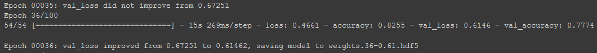

### b. Extraction des features

Avec Keras, il est possible d’observer les caractéristiques extraites par les filtres de convolutions du modèle.

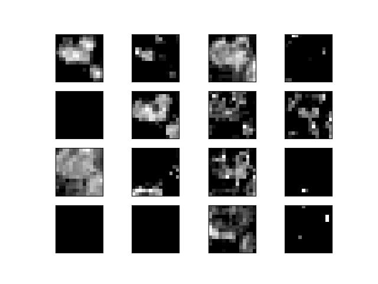
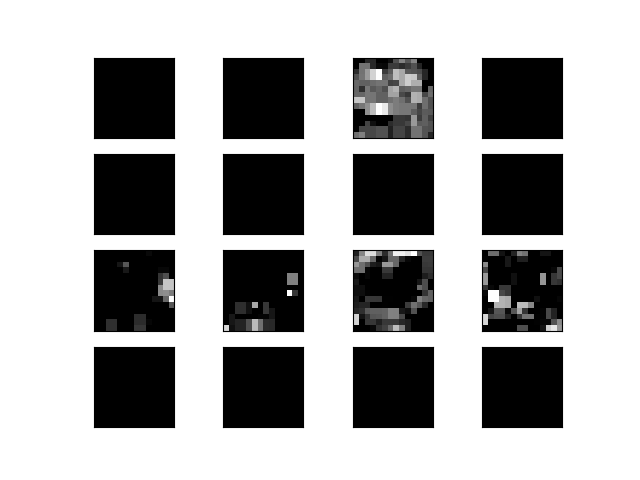
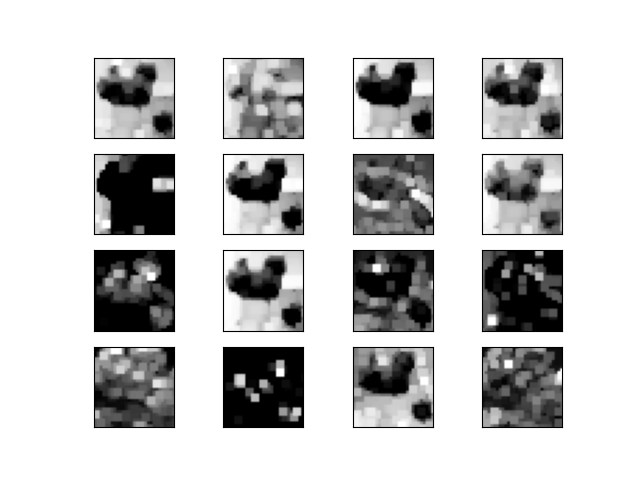
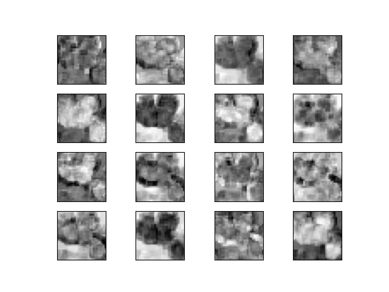
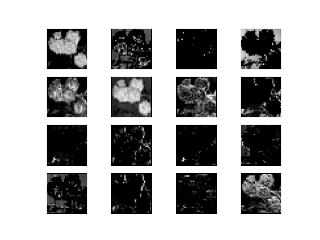
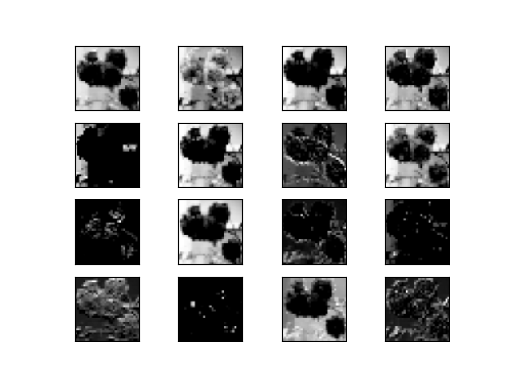

### c. Résultats 

**Rose :**
rose 0.70560682
daisy 0.29298031
dandelion 0.0013545305
sunflower 0.000052835607
tulip 0.0000055734072

**Rosetulip:**

rose 0.99418563
dandelion 0.0014568941
daisy 0.0043221936
sunflower 0.000030934043
tulip 0.0000044345020

**Sun:**
rose 0.81088716
daisy 0.18447946
sunflower 0.0045855162
dandelion 0.000047037811
tulip 0.00000085125743

**De_tout:**
daisy 0.65639359
rose 0.34166390
dandelion 0.0010730935
tulip 0.00086842693
sunflower 0.00000093422130

**Daisy:**
rose 0.95671463
daisy 0.028695641
dandelion 0.014586471
sunflower 0.000003.1854252
tulip 0.0000000091694137

**Dand:**
daisy 0.89664221
rose 0.10324556
sunflower 0.000018046019
dandelion 0.000093968447
tulip 0.00000020535882

**Souffle:**
dandelion 0.99796993
daisy 0.0012352887
rose 0.00077487098
sunflower 0.000015674348
tulip 0.0000042655129


## Inception V3

_[Source](https://medium.com/@amalpaul0492/step-by-step-tensorflows-sample-flower-classification-tutorial-626e39a7ea0a)_

Inception v3 est un modèle de reconnaissance d'images couramment utilisé qui a démontré, sur l'ensemble de données ImageNet, une justesse supérieure à 78,1 %. Il s'agit de l'aboutissement de nombreuses idées développées par plusieurs chercheurs au fil des années. Il est basé sur l'article originel Rethinking the Inception Architecture for Computer Vision (Repenser l'architecture Inception pour la vision par ordinateur) de Szegedy, et. al.
Le modèle lui-même est constitué de composants de base symétriques et asymétriques incluant convolutions, pooling moyen, pooling maximal, concaténations, abandons et couches entièrement connectées. La normalisation par lots (batchnorm) est amplement utilisée dans le modèle et appliqué aux entrées d'activation. La perte est calculée via Softmax.


### a. Implémentation

Le modèle Inception v3, pré entraîné sur les données ImageNet est constitué de 7 couches, voir ci dessus le schéma. A ces 7 couches nous avons ajouté une couche fully connected permettant de ré entraîner le modèles sur nos classes : daysi, dendelion, rose, sunflower et tulip.

### b. Résultats

En comparaison des résultats du CNN Home Made, le modèle Inception v3 renvoie de meilleurs résultats sur l'entraînement, mais pas aussi significativement que nous le pensions : 

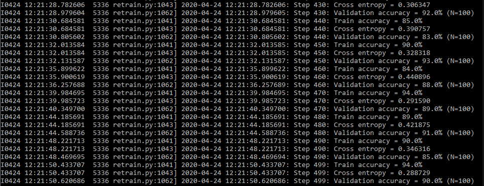

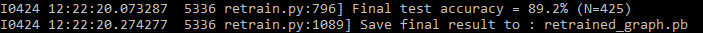

Sur les données de test, le modèle semble avoir bien appris. Un petit bémol sur les dandelions qui sont représentés de deux manières relativement distinctes : en fleur jaune ou en boule à pistile. 
Lors de la séparation des jeux de données train et test, il se peut que le mélange des dandelions n'est pas été correctement homogènes, et de ce fait, le modèle semble les reconnaître sur leur forme
de boule et moins bien sous la forme de fleur. 


*Résultats:*

```
rose 0.8698792
tulip 0.05951355
sunflower 0.05443528
daisy 0.012677312
dandelion 0.0034946725
```


*Résultats:*

```
rose 0.78507674
tulip 0.19733186
daisy 0.008969039
sunflower 0.0046077645
dandelion 0.0040145987
```

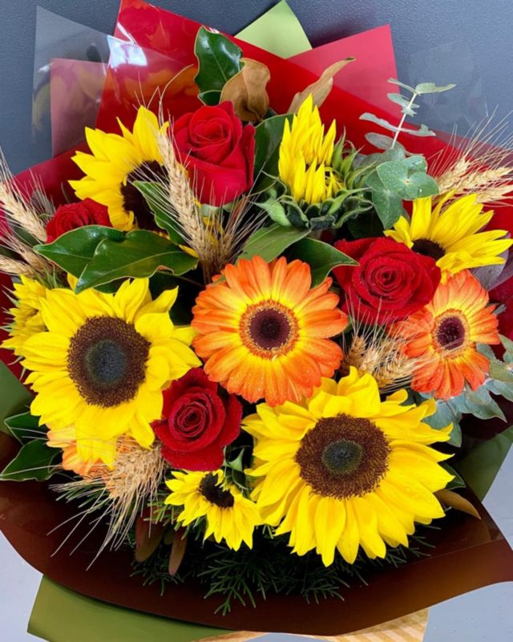

*Résultats:*

```
sunflower 0.85328513
daisy 0.0769573
tulip 0.04169053
rose 0.023621354
dandelion 0.0044456623
```


*Résultats:*

```
sunflower 0.9190891
rose 0.054834332
tulip 0.014547719
daisy 0.009189899
dandelion 0.0023389645
```

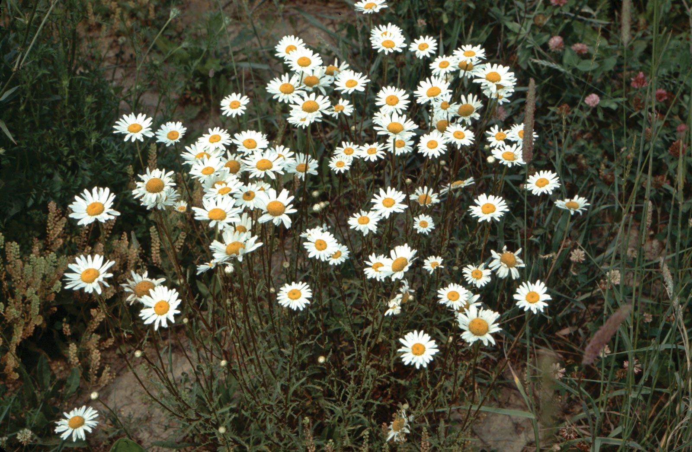

*Résultats:*

```
daisy 0.9995875
sunflower 0.0002530757
dandelion 0.00013128218
tulip 2.2902886e-05
rose 5.2693217e-06
```

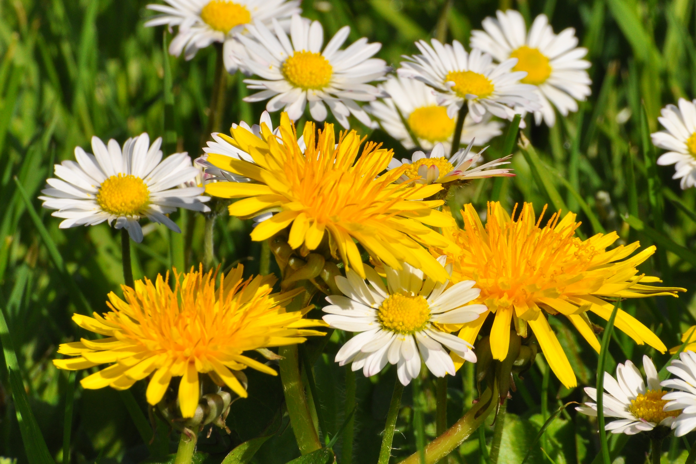

*Résultats:*

```
daisy 0.9587073
sunflower 0.032715585
dandelion 0.004644958
tulip 0.0036554784
rose 0.00027668505
```


*Résultats:*

```
dandelion 0.71772665
daisy 0.20059307
sunflower 0.04220597
tulip 0.036054574
rose 0.0034197627
```

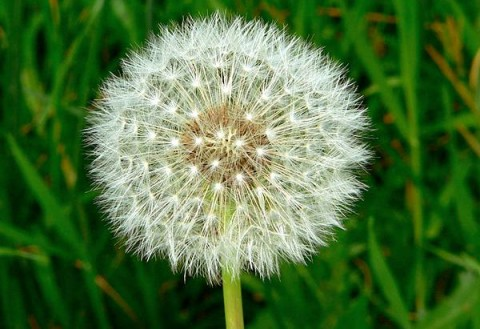

*Résultats:*

```
dandelion 0.99303436
sunflower 0.0028218022
daisy 0.0023953475
tulip 0.0012059223
rose 0.0005425634
```
